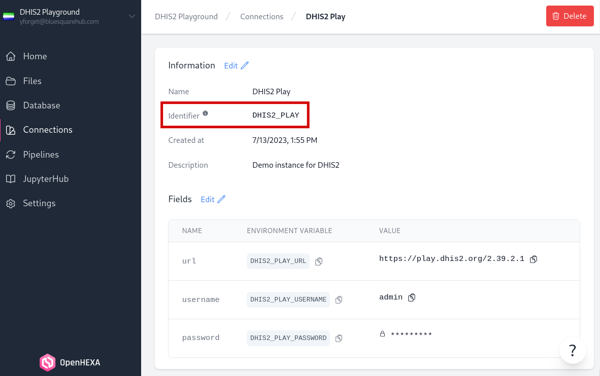

<!-- vscode-markdown-toc-config
	numbering=false
	autoSave=true
	/vscode-markdown-toc-config -->
<!-- /vscode-markdown-toc -->

# OpenHexa Toolbox DHIS2

An utility library to acquire and process data from a DHIS2 instance.

<!-- vscode-markdown-toc -->
* [Installation](#Installation)
* [Usage](#Usage)
	* [Connect to an instance](#Connecttoaninstance)
	* [Caching](#Caching)
	* [Read metadata](#Readmetadata)
	* [Read data](#Readdata)
		* [Data value sets](#Datavaluesets)
		* [Analytics](#Analytics)
	* [Joining metadata fields](#Joiningmetadatafields)
		* [Names](#Names)
		* [Pyramid](#Pyramid)
	* [Write data](#Writedata)

## <a name='Installation'></a>Installation

``` sh
pip install openhexa.toolbox
```

## <a name='Usage'></a>Usage

### <a name='Connecttoaninstance'></a>Connect to an instance

Credentials are required to initialize a connection to a DHIS2 instance, and must be provided through a `Connection` object.

In an OpenHexa workspace (e.g. in an OpenHexa pipeline or in an OpenHexa notebook), a `Connection` object can be created using the OpenHexa SDK by providing the identifier of the workspace connection.



``` python
>>> from openhexa.sdk import workspace
>>> from openhexa.toolbox.dhis2 import DHIS2

>>> # initialize a new connection in an OpenHexa workspace
>>> con = workspace.dhis2_connection("DHIS2_PLAY")
>>> dhis = DHIS2(con)
```

Outside an OpenHexa workspace, a connection can be manually created using the SDK by providing the instance URL, an username and a password.


``` python
>>> from openhexa.sdk.workspaces.connections import DHIS2Connection
>>> from openhexa.toolbox.dhis2 import DHIS2

>>> # initialize a new connection outside an OpenHexa workspace
>>> con = DHIS2Connection(url="https://play.dhis2.org/40.0.1", username="admin", password="district")
>>> dhis = DHIS2(con)
```

If needed, the OpenHexa SDK dependency can be bypassed by providing a `namedtuple` instead of a `Connection` object.

``` python
>>> from collections import namedtuple
>>> from openhexa.toolbox.dhis2 import DHIS2

>>> # initialize a new connection outside an OpenHexa workspace
>>> Connection = namedtuple("Connection", ["url", "username", "password"])
>>> con = Connection(url="https://play.dhis2.org/40.0.1", username="admin", password="district")
>>> dhis = DHIS2(con)
```

### <a name='Caching'></a>Caching

Caching can be activated by providing a cache directory when initializing a new connection.

``` python
>>> from openhexa.sdk import workspace
>>> from openhexa.toolbox.dhis2 import DHIS2

>>> # initialize a new connection in an OpenHexa workspace
>>> con = workspace.dhis2_connection("DHIS2_PLAY")
>>> dhis = DHIS2(con, cache_dir=".cache")
```

As of now, the library only caches instance metadata and does not handle data queries.

### <a name='Readmetadata'></a>Read metadata

Instance metadata can be accessed through a set of methods under the `DHIS2.meta` namespace. Metadata are always returned as JSON-like objects that can easily be converted into Pandas or Polars dataframes.

``` python
>>> import polars as pl
>>> from openhexa.sdk import workspace
>>> from openhexa.toolbox.dhis2 import DHIS2

>>> # initialize a new connection in an OpenHexa workspace
>>> con = workspace.dhis2_connection("DHIS2_PLAY")
>>> dhis = DHIS2(con, cache_dir=".cache")

>>> # read organisation units metadata
>>> org_units = dhis.meta.organisation_units()
>>> df = pl.DataFrame(org_units)

>>> print(df)

shape: (1_332, 5)
┌─────────────┬──────────────────────┬───────┬─────────────────────────────────┬───────────────────┐
│ id          ┆ name                 ┆ level ┆ path                            ┆ geometry          │
│ ---         ┆ ---                  ┆ ---   ┆ ---                             ┆ ---               │
│ str         ┆ str                  ┆ i64   ┆ str                             ┆ str               │
╞═════════════╪══════════════════════╪═══════╪═════════════════════════════════╪═══════════════════╡
│ Rp268JB6Ne4 ┆ Adonkia CHP          ┆ 4     ┆ /ImspTQPwCqd/at6UHUQatSo/qtr8GG ┆ null              │
│             ┆                      ┆       ┆ l…                              ┆                   │
│ cDw53Ej8rju ┆ Afro Arab Clinic     ┆ 4     ┆ /ImspTQPwCqd/at6UHUQatSo/qtr8GG ┆ null              │
│             ┆                      ┆       ┆ l…                              ┆                   │
│ GvFqTavdpGE ┆ Agape CHP            ┆ 4     ┆ /ImspTQPwCqd/O6uvpzGd5pu/U6Kr7G ┆ null              │
│             ┆                      ┆       ┆ t…                              ┆                   │
│ plnHVbJR6p4 ┆ Ahamadyya Mission Cl ┆ 4     ┆ /ImspTQPwCqd/PMa2VCrupOd/QywkxF ┆ {"type": "Point", │
│             ┆                      ┆       ┆ u…                              ┆ "coordinates":…   │
│ …           ┆ …                    ┆ …     ┆ …                               ┆ …                 │
│ hDW65lFySeF ┆ Youndu CHP           ┆ 4     ┆ /ImspTQPwCqd/jmIPBj66vD6/Z9QaI6 ┆ null              │
│             ┆                      ┆       ┆ s…                              ┆                   │
│ Urk55T8KgpT ┆ Yoyah CHP            ┆ 4     ┆ /ImspTQPwCqd/jUb8gELQApl/yu4N82 ┆ null              │
│             ┆                      ┆       ┆ F…                              ┆                   │
│ VdXuxcNkiad ┆ Yoyema MCHP          ┆ 4     ┆ /ImspTQPwCqd/jmIPBj66vD6/USQdmv ┆ {"type": "Point", │
│             ┆                      ┆       ┆ r…                              ┆ "coordinates":…   │
│ BNFrspDBKel ┆ Zimmi CHC            ┆ 4     ┆ /ImspTQPwCqd/bL4ooGhyHRQ/BD9gU0 ┆ {"type": "Point", │
│             ┆                      ┆       ┆ G…                              ┆ "coordinates":…   │
└─────────────┴──────────────────────┴───────┴─────────────────────────────────┴───────────────────┘
```

The following metadata types are supported:
* `DHIS2.meta.system_info()`
* `DHIS2.meta.organisation_units()`
* `DHIS2.meta.organisation_unit_groups()`
* `DHIS2.meta.organisation_unit_levels()`
* `DHIS2.meta.datasets()`
* `DHIS2.meta.data_elements()`
* `DHIS2.meta.data_element_groups()`
* `DHIS2.meta.indicators()`
* `DHIS2.meta.indicator_groups()`
* `DHIS2.meta.category_option_combos()`

### <a name='Readdata'></a>Read data

Data can be accessed through two distinct endpoints: [`dataValueSets`](https://docs.dhis2.org/en/develop/using-the-api/dhis-core-version-240/data.html#webapi_reading_data_values) and [`analytics`](https://docs.dhis2.org/en/develop/using-the-api/dhis-core-version-240/analytics.html). The `dataValueSets` endpoint allows to query raw data values stored in the DHIS2 database, while `analytics` can access aggregated data stored in the DHIS2 analytics tables.

#### <a name='Datavaluesets'></a>Data value sets

Raw data values can be read using the `DHIS2.data_value_sets.get()` method. The method accepts the following arguments:

* **`data_elements`** : *list of str, optional*<br>
    Data element identifiers (requires DHIS2 >= 2.39)


* **`datasets`** : *list of str, optional*<br>
    Dataset identifiers

* **`data_element_groups`** : *str, optiona*l<br>
    Data element groups identifiers

* **`periods`** : *list of str, optional*<br>
    Period identifiers in ISO format

* **`start_date`** : *str, optional*<br>
    Start date for the time span of the values to export

* **`end_date`** : *str, optional*<br>
    End date for the time span of the values to export

* **`org_units`** : *list of str, optional*<br>
    Organisation units identifiers

* **`org_unit_groups`** : *list of str, optional*<br>
    Organisation unit groups identifiers

* **`children`** : *bool, optional (default=False)*<br>
    Whether to include the children in the hierarchy of the organisation units

* **`attribute_option_combos`** : *list of str, optional*<br>
    Attribute option combos identifiers

* **`last_updated`** : *str, optional*<br>
    Include only data values which are updated since the given time stamp

* **`last_updated_duration`** : *str, optional*<br>
    Include only data values which are updated within the given duration. The
    format is <value><time-unit>, where the supported time units are "d" (days),
    "h" (hours), "m" (minutes) and "s" (seconds).

At least 3 arguments must be provided:
* One in the data dimension (`data_elements`, `data_element_groups`, or `datasets`)
* One in the spatial dimension (`org_units` or `org_unit_groups`)
* One in the temporal dimension (`periods` or `start_date` and `end_date`)

Data values are returned in a JSON-like list of dictionaries that can be converted into a Pandas or Polars dataframe.

```python
>>> import polars as pl
>>> from openhexa.sdk import workspace
>>> from openhexa.toolbox.dhis2 import DHIS2

>>> # initialize a new connection in an OpenHexa workspace
>>> con = workspace.dhis2_connection("DHIS2_PLAY")
>>> dhis = DHIS2(con, cache_dir=".cache")

>>> data_values = dhis.data_value_sets.get(
...     datasets=["QX4ZTUbOt3a"],
...     org_units=["JQr6TJx5KE3", "KbO0JnhiMwl", "f90eISKFm7P"],
...     start_date="2022-01-01",
...     end_date="2022-04-01"
... )

>>> print(len(data_values))
301

>>> print(data_values[0])
{
    'dataElement': 'zzHwXqxKYy1', 'period': '202201', 'orgUnit': 'JQr6TJx5KE3', 'categoryOptionCombo': 'r8xySVHExGT', 'attributeOptionCombo': 'HllvX50cXC0', 'value': '2', 'storedBy': 'kailahun1', 'created': '2010-03-07T00:00:00.000+0000', 'lastUpdated': '2010-03-07T00:00:00.000+0000', 'comment': '', 'followup': False
}

>>> df = pl.DataFrame(data_values)
>>> print(df)

shape: (301, 11)
┌────────────┬────────┬────────────┬────────────┬───┬────────────┬────────────┬─────────┬──────────┐
│ dataElemen ┆ period ┆ orgUnit    ┆ categoryOp ┆ … ┆ created    ┆ lastUpdate ┆ comment ┆ followup │
│ t          ┆ ---    ┆ ---        ┆ tionCombo  ┆   ┆ ---        ┆ d          ┆ ---     ┆ ---      │
│ ---        ┆ str    ┆ str        ┆ ---        ┆   ┆ str        ┆ ---        ┆ str     ┆ bool     │
│ str        ┆        ┆            ┆ str        ┆   ┆            ┆ str        ┆         ┆          │
╞════════════╪════════╪════════════╪════════════╪═══╪════════════╪════════════╪═════════╪══════════╡
│ zzHwXqxKYy ┆ 202201 ┆ JQr6TJx5KE ┆ r8xySVHExG ┆ … ┆ 2010-03-07 ┆ 2010-03-07 ┆         ┆ false    │
│ 1          ┆        ┆ 3          ┆ T          ┆   ┆ T00:00:00. ┆ T00:00:00. ┆         ┆          │
│            ┆        ┆            ┆            ┆   ┆ 000+0000   ┆ 000+0000   ┆         ┆          │
│ zzHwXqxKYy ┆ 202201 ┆ JQr6TJx5KE ┆ cBQmyRrEKo ┆ … ┆ 2010-03-07 ┆ 2010-03-07 ┆         ┆ false    │
│ 1          ┆        ┆ 3          ┆ 3          ┆   ┆ T00:00:00. ┆ T00:00:00. ┆         ┆          │
│            ┆        ┆            ┆            ┆   ┆ 000+0000   ┆ 000+0000   ┆         ┆          │
│ zzHwXqxKYy ┆ 202201 ┆ JQr6TJx5KE ┆ U1PHVSShuW ┆ … ┆ 2010-03-07 ┆ 2010-03-07 ┆         ┆ false    │
│ 1          ┆        ┆ 3          ┆ j          ┆   ┆ T00:00:00. ┆ T00:00:00. ┆         ┆          │
│            ┆        ┆            ┆            ┆   ┆ 000+0000   ┆ 000+0000   ┆         ┆          │
│ zzHwXqxKYy ┆ 202201 ┆ f90eISKFm7 ┆ dcguXUTwen ┆ … ┆ 2010-03-12 ┆ 2010-03-12 ┆         ┆ false    │
│ 1          ┆        ┆ P          ┆ I          ┆   ┆ T00:00:00. ┆ T00:00:00. ┆         ┆          │
│            ┆        ┆            ┆            ┆   ┆ 000+0000   ┆ 000+0000   ┆         ┆          │
│ …          ┆ …      ┆ …          ┆ …          ┆ … ┆ …          ┆ …          ┆ …       ┆ …        │
│ h8vtacmZL5 ┆ 202203 ┆ f90eISKFm7 ┆ bckzBoAurH ┆ … ┆ 2010-05-21 ┆ 2010-05-21 ┆         ┆ false    │
│ j          ┆        ┆ P          ┆ I          ┆   ┆ T00:00:00. ┆ T00:00:00. ┆         ┆          │
│            ┆        ┆            ┆            ┆   ┆ 000+0000   ┆ 000+0000   ┆         ┆          │
│ h8vtacmZL5 ┆ 202203 ┆ f90eISKFm7 ┆ TDb5JyDQqh ┆ … ┆ 2010-05-21 ┆ 2010-05-21 ┆         ┆ false    │
│ j          ┆        ┆ P          ┆ o          ┆   ┆ T00:00:00. ┆ T00:00:00. ┆         ┆          │
│            ┆        ┆            ┆            ┆   ┆ 000+0000   ┆ 000+0000   ┆         ┆          │
│ h8vtacmZL5 ┆ 202203 ┆ f90eISKFm7 ┆ y1jbXYIuub ┆ … ┆ 2010-05-21 ┆ 2010-05-21 ┆         ┆ false    │
│ j          ┆        ┆ P          ┆ N          ┆   ┆ T00:00:00. ┆ T00:00:00. ┆         ┆          │
│            ┆        ┆            ┆            ┆   ┆ 000+0000   ┆ 000+0000   ┆         ┆          │
│ h8vtacmZL5 ┆ 202203 ┆ f90eISKFm7 ┆ x1Ti1RoTKF ┆ … ┆ 2010-05-21 ┆ 2010-05-21 ┆         ┆ false    │
│ j          ┆        ┆ P          ┆ r          ┆   ┆ T00:00:00. ┆ T00:00:00. ┆         ┆          │
│            ┆        ┆            ┆            ┆   ┆ 000+0000   ┆ 000+0000   ┆         ┆          │
└────────────┴────────┴────────────┴────────────┴───┴────────────┴────────────┴─────────┴──────────┘
```

#### <a name='Analytics'></a>Analytics

Aggregated data from the Analytics tables can be read using the `DHIS2.analytics.get()` method. The method accepts the following arguments:

* **`data_elements`** : *list of str, optional*<br>
    Data element identifiers

* **`data_element_groups`** : *list of str, optional*<br>
    Data element groups identifiers

* **`indicators`**: *list of str, optional*<br>
    Indicator identifiers

* **`indicator_groups`**: *list of str, optional*<br>
    Indicator groups identifiers

* **`periods`** : *list of str, optional*<br>
    Period identifiers in ISO format

* **`org_units`** : *list of str, optional*<br>
    Organisation units identifiers

* **`org_unit_groups`** : *list of str, optional*<br>
    Organisation unit groups identifiers

* **`org_unit_levels`** : *list of int, optional*<br>
    Organisation unit levels

* **`include_cocs`** : *bool, optional (default=True)*<br>
    Include category option combos in response

At least 3 arguments must be provided:
* One in the data dimension (`data_elements`, `data_element_groups`, `indicators` or `indicator_groups`)
* One in the spatial dimension (`org_units`, `org_unit_groups` or `org_unit_levels`)
* One in the temporal dimension (`periods`)

Data values are returned in a JSON-like list of dictionaries that can be converted into a Pandas or Polars dataframe.

```python
>>> import polars as pl
>>> from openhexa.sdk import workspace
>>> from openhexa.toolbox.dhis2 import DHIS2

>>> # initialize a new connection in an OpenHexa workspace
>>> con = workspace.dhis2_connection("DHIS2_PLAY")
>>> dhis = DHIS2(con, cache_dir=".cache")

>>> data_values = play.analytics.get(
...     data_elements=["V37YqbqpEhV", "tn3p7vIxoKY", "HZSdnO5fCUc"],
...     org_units=["JQr6TJx5KE3", "KbO0JnhiMwl", "f90eISKFm7P"],
...     periods=["202201", "202202", "202203"]
... )

>>> df = pl.DataFrame(data_values)
>>> print(df)

shape: (14, 5)
┌─────────────┬─────────────┬─────────────┬────────┬───────┐
│ dx          ┆ co          ┆ ou          ┆ pe     ┆ value │
│ ---         ┆ ---         ┆ ---         ┆ ---    ┆ ---   │
│ str         ┆ str         ┆ str         ┆ str    ┆ str   │
╞═════════════╪═════════════╪═════════════╪════════╪═══════╡
│ V37YqbqpEhV ┆ PT59n8BQbqM ┆ JQr6TJx5KE3 ┆ 202201 ┆ 5     │
│ V37YqbqpEhV ┆ pq2XI5kz2BY ┆ f90eISKFm7P ┆ 202201 ┆ 4     │
│ V37YqbqpEhV ┆ PT59n8BQbqM ┆ f90eISKFm7P ┆ 202201 ┆ 11    │
│ V37YqbqpEhV ┆ pq2XI5kz2BY ┆ JQr6TJx5KE3 ┆ 202201 ┆ 2     │
│ …           ┆ …           ┆ …           ┆ …      ┆ …     │
│ V37YqbqpEhV ┆ pq2XI5kz2BY ┆ KbO0JnhiMwl ┆ 202203 ┆ 12    │
│ V37YqbqpEhV ┆ pq2XI5kz2BY ┆ JQr6TJx5KE3 ┆ 202203 ┆ 5     │
│ V37YqbqpEhV ┆ PT59n8BQbqM ┆ JQr6TJx5KE3 ┆ 202203 ┆ 8     │
│ V37YqbqpEhV ┆ pq2XI5kz2BY ┆ f90eISKFm7P ┆ 202203 ┆ 13    │
└─────────────┴─────────────┴─────────────┴────────┴───────┘
```

### <a name='Joiningmetadatafields'></a>Joining metadata fields

#### <a name='Names'></a>Names

Helper methods to add name columns in addition to identifiers are available under the `DHIS.meta` namespace:

* `DHIS2.meta.add_dx_name_column()`
* `DHIS2.meta.add_coc_name_column()`
* `DHIS2.meta.add_org_unit_name_column()`

```python
>>> import polars as pl
>>> from openhexa.sdk import workspace
>>> from openhexa.toolbox.dhis2 import DHIS2

>>> # initialize a new connection in an OpenHexa workspace
>>> con = workspace.dhis2_connection("DHIS2_PLAY")
>>> dhis = DHIS2(con, cache_dir=".cache")

>>> data_values = dhis.analytics.get(
...     data_elements=["V37YqbqpEhV", "tn3p7vIxoKY", "HZSdnO5fCUc"],
...     org_units=["JQr6TJx5KE3", "KbO0JnhiMwl", "f90eISKFm7P"],
...     periods=["202201", "202202", "202203"]
... )

>>> df = pl.DataFrame(data_values)
>>> df = dhis.meta.add_dx_name_column(df)
>>> print(df)

shape: (14, 6)
┌─────────────┬─────────────┬─────────────┬────────┬───────┬───────────────────────────┐
│ dx          ┆ co          ┆ ou          ┆ pe     ┆ value ┆ dx_name                   │
│ ---         ┆ ---         ┆ ---         ┆ ---    ┆ ---   ┆ ---                       │
│ str         ┆ str         ┆ str         ┆ str    ┆ str   ┆ str                       │
╞═════════════╪═════════════╪═════════════╪════════╪═══════╪═══════════════════════════╡
│ V37YqbqpEhV ┆ PT59n8BQbqM ┆ JQr6TJx5KE3 ┆ 202201 ┆ 5     ┆ IPT 2nd dose given at PHU │
│ V37YqbqpEhV ┆ pq2XI5kz2BY ┆ f90eISKFm7P ┆ 202201 ┆ 4     ┆ IPT 2nd dose given at PHU │
│ V37YqbqpEhV ┆ PT59n8BQbqM ┆ f90eISKFm7P ┆ 202201 ┆ 11    ┆ IPT 2nd dose given at PHU │
│ V37YqbqpEhV ┆ pq2XI5kz2BY ┆ JQr6TJx5KE3 ┆ 202201 ┆ 2     ┆ IPT 2nd dose given at PHU │
│ …           ┆ …           ┆ …           ┆ …      ┆ …     ┆ …                         │
│ V37YqbqpEhV ┆ pq2XI5kz2BY ┆ KbO0JnhiMwl ┆ 202203 ┆ 12    ┆ IPT 2nd dose given at PHU │
│ V37YqbqpEhV ┆ pq2XI5kz2BY ┆ JQr6TJx5KE3 ┆ 202203 ┆ 5     ┆ IPT 2nd dose given at PHU │
│ V37YqbqpEhV ┆ PT59n8BQbqM ┆ JQr6TJx5KE3 ┆ 202203 ┆ 8     ┆ IPT 2nd dose given at PHU │
│ V37YqbqpEhV ┆ pq2XI5kz2BY ┆ f90eISKFm7P ┆ 202203 ┆ 13    ┆ IPT 2nd dose given at PHU │
└─────────────┴─────────────┴─────────────┴────────┴───────┴───────────────────────────┘
```

#### <a name='Pyramid'></a>Pyramid

An helper method to add the full org. unit pyramid to a dataframe is available under the `DHIS.meta` namespace:

* `DHIS2.meta.add_org_unit_parent_columns()`

```python
>>> import polars as pl
>>> from openhexa.sdk import workspace
>>> from openhexa.toolbox.dhis2 import DHIS2

>>> # initialize a new connection in an OpenHexa workspace
>>> con = workspace.dhis2_connection("DHIS2_PLAY")
>>> dhis = DHIS2(con, cache_dir=".cache")

>>> data_values = dhis.analytics.get(
...     data_elements=["V37YqbqpEhV", "tn3p7vIxoKY", "HZSdnO5fCUc"],
...     org_units=["JQr6TJx5KE3", "KbO0JnhiMwl", "f90eISKFm7P"],
...     periods=["202201", "202202", "202203"]
... )

>>> df = pl.DataFrame(data_values)
>>> df = dhis.meta.add_org_unit_parent_columns(df)
>>> print(df)

shape: (14, 11)
┌────────────┬────────────┬───────────┬────────┬───┬───────────┬───────────┬───────────┬───────────┐
│ dx         ┆ co         ┆ ou        ┆ pe     ┆ … ┆ parent_le ┆ parent_le ┆ parent_le ┆ parent_le │
│ ---        ┆ ---        ┆ ---       ┆ ---    ┆   ┆ vel_2_id  ┆ vel_2_nam ┆ vel_3_id  ┆ vel_3_nam │
│ str        ┆ str        ┆ str       ┆ str    ┆   ┆ ---       ┆ e         ┆ ---       ┆ e         │
│            ┆            ┆           ┆        ┆   ┆ str       ┆ ---       ┆ str       ┆ ---       │
│            ┆            ┆           ┆        ┆   ┆           ┆ str       ┆           ┆ str       │
╞════════════╪════════════╪═══════════╪════════╪═══╪═══════════╪═══════════╪═══════════╪═══════════╡
│ V37YqbqpEh ┆ PT59n8BQbq ┆ JQr6TJx5K ┆ 202201 ┆ … ┆ jUb8gELQA ┆ Kailahun  ┆ cM2BKSrj9 ┆ Luawa     │
│ V          ┆ M          ┆ E3        ┆        ┆   ┆ pl        ┆           ┆ F9        ┆           │
│ V37YqbqpEh ┆ pq2XI5kz2B ┆ f90eISKFm ┆ 202201 ┆ … ┆ kJq2mPyFE ┆ Kenema    ┆ vzup1f6yn ┆ Small Bo  │
│ V          ┆ Y          ┆ 7P        ┆        ┆   ┆ Ho        ┆           ┆ ON        ┆           │
│ V37YqbqpEh ┆ PT59n8BQbq ┆ f90eISKFm ┆ 202201 ┆ … ┆ kJq2mPyFE ┆ Kenema    ┆ vzup1f6yn ┆ Small Bo  │
│ V          ┆ M          ┆ 7P        ┆        ┆   ┆ Ho        ┆           ┆ ON        ┆           │
│ V37YqbqpEh ┆ pq2XI5kz2B ┆ JQr6TJx5K ┆ 202201 ┆ … ┆ jUb8gELQA ┆ Kailahun  ┆ cM2BKSrj9 ┆ Luawa     │
│ V          ┆ Y          ┆ E3        ┆        ┆   ┆ pl        ┆           ┆ F9        ┆           │
│ …          ┆ …          ┆ …         ┆ …      ┆ … ┆ …         ┆ …         ┆ …         ┆ …         │
│ V37YqbqpEh ┆ pq2XI5kz2B ┆ KbO0JnhiM ┆ 202203 ┆ … ┆ PMa2VCrup ┆ Kambia    ┆ QywkxFudX ┆ Magbema   │
│ V          ┆ Y          ┆ wl        ┆        ┆   ┆ Od        ┆           ┆ rC        ┆           │
│ V37YqbqpEh ┆ pq2XI5kz2B ┆ JQr6TJx5K ┆ 202203 ┆ … ┆ jUb8gELQA ┆ Kailahun  ┆ cM2BKSrj9 ┆ Luawa     │
│ V          ┆ Y          ┆ E3        ┆        ┆   ┆ pl        ┆           ┆ F9        ┆           │
│ V37YqbqpEh ┆ PT59n8BQbq ┆ JQr6TJx5K ┆ 202203 ┆ … ┆ jUb8gELQA ┆ Kailahun  ┆ cM2BKSrj9 ┆ Luawa     │
│ V          ┆ M          ┆ E3        ┆        ┆   ┆ pl        ┆           ┆ F9        ┆           │
│ V37YqbqpEh ┆ pq2XI5kz2B ┆ f90eISKFm ┆ 202203 ┆ … ┆ kJq2mPyFE ┆ Kenema    ┆ vzup1f6yn ┆ Small Bo  │
│ V          ┆ Y          ┆ 7P        ┆        ┆   ┆ Ho        ┆           ┆ ON        ┆           │
└────────────┴────────────┴───────────┴────────┴───┴───────────┴───────────┴───────────┴───────────┘
```

### <a name='Writedata'></a>Write data

In developement.
